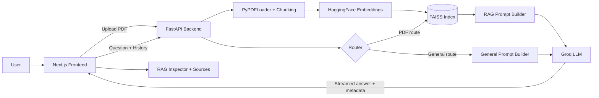

# Explainable Multilingual RAG Workspace

An end-to-end **RAG application** for asking questions about PDFs in **Arabic or English**.

**Links**

- **GitHub**: [ahmedgeeter](https://github.com/ahmedgeeter)
- **LinkedIn**: [Ahmed AI Dev](https://www.linkedin.com/in/ahmed-ai-dev/)

It combines:

- **FastAPI** for backend orchestration
- **FAISS** for local vector retrieval
- **Groq** for fast LLM inference and streaming
- **Next.js 15** for a polished chat UI
- **RAG Inspector** for routing and retrieval transparency

## What makes this project strong

- **Document-grounded answers** with source snippets and page references
- **Agentic routing** between PDF context and general knowledge
- **Arabic-aware retrieval** and follow-up question support
- **Streaming UX** with citations and response metadata
- **Production-minded setup** with Docker, health checks, CORS, and split frontend/backend deployment

## Use cases

- **Technical document assistant**
  - RFCs, manuals, product docs, internal documentation
- **Research assistant**
  - summarize findings, extract evidence, compare sections
- **Policy / compliance review**
  - locate exact clauses, sections, and page references
- **Bilingual document QA**
  - ask in Arabic or English across the same conversation

## Architecture diagram



## How it works

1. Upload a PDF
2. Extract and chunk the document
3. Generate embeddings and store them in FAISS
4. Send the user question and recent chat history to the backend
5. Route the request to either:
   - **PDF retrieval + grounded answer**, or
   - **General knowledge answer**
6. Stream the response back to the UI
7. Show citations, latency, and inspector metadata

## Key features

- **PDF upload and indexing**
- **Streaming chat**
- **Conversation-aware follow-up handling**
- **Arabic text normalization**
- **Page-aware citations**
- **Route + retrieval inspector**
- **Direction-aware Arabic/English UI**

## Challenges solved

| Challenge | What I changed | Outcome |
|---|---|---|
| Arabic retrieval quality | Added Arabic normalization before retrieval | Better Arabic matching |
| Weak follow-up handling | Sent history to backend and enriched retrieval queries | Better page/citation follow-ups |
| Black-box answers | Added sources, page labels, and inspector metadata | More explainable answers |
| Hardcoded model risk | Made LLM and embedding models configurable via env vars | Easier maintenance |
| Deployment issues | Added CORS config, health checks, Docker, runtime port config | Cleaner production setup |
| Vercel misconfiguration | Simplified root config and deployed frontend from `frontend` | Correct frontend deployment |
| Cold start overhead | Kept embeddings lazy-loaded and used a lighter default model | Better free-tier deploy behavior |

## Tech stack

| Layer | Tools |
|---|---|
| Frontend | Next.js 15.5.14, React 19, Tailwind CSS, TypeScript |
| Backend | FastAPI, LangChain, Groq |
| Retrieval | FAISS, Hugging Face sentence-transformers |
| Document parsing | PyPDFLoader |
| Deployment | Vercel, Hugging Face Spaces, Docker |

## Project structure

```text
RAG/
├── backend/
│   ├── main.py
│   ├── requirements.txt
│   ├── Dockerfile
│   └── .env.example
├── frontend/
│   ├── app/
│   ├── components/
│   ├── lib/
│   ├── package.json
│   └── .env.example
├── Dockerfile
├── render.yaml
├── vercel.json
└── README.md
```

## API surface

- `POST /upload`
  - Upload and index a PDF
- `POST /chat`
  - Non-streaming answer with sources, route, timing, and inspector data
- `POST /chat/stream`
  - Streaming SSE answer
- `GET /health`
- `GET /health/ready`

## Quick start

### Backend env

Create `backend/.env` from `backend/.env.example`:

```bash
GROQ_API_KEY=your_groq_api_key_here
GROQ_MODEL=llama-3.3-70b-versatile
EMBEDDING_MODEL_NAME=sentence-transformers/all-MiniLM-L6-v2
ALLOWED_ORIGINS=http://localhost:3000,http://127.0.0.1:3000
ALLOWED_ORIGIN_REGEX=https://.*\.vercel\.app
```

### Frontend env

Create `frontend/.env.local`:

```bash
NEXT_PUBLIC_API_URL=http://localhost:8000
```

### Run locally

```bash
pip install -r backend/requirements.txt
python -m uvicorn backend.main:app --host 0.0.0.0 --port 8000 --reload
```

```bash
cd frontend
npm install
npm run dev
```

- **Frontend**: `http://localhost:3000`
- **Backend**: `http://localhost:8000`

## Docker

```bash
docker compose up --build
```

## Deployment

- **Frontend**: deploy `frontend/` to Vercel
- **Backend**: deploy the root Docker setup to Hugging Face Spaces
- **Alternative backend option**: `render.yaml` is included for Render

## Limitations

- FAISS index is **in memory only**
- Only **one active PDF** is supported at a time
- No authentication yet
- No persistent vector storage yet

## Next improvements

- Multi-document support
- Persistent vector DB
- Authentication and user workspaces
- Evaluation dashboard
- Analytics / observability

## Why this stands out

This is not just an LLM wrapper. It demonstrates:

- retrieval engineering
- routing and prompt orchestration
- multilingual UX handling
- explainability through inspector metadata
- deployment/debugging across frontend and backend

That combination makes it a strong **AI engineer portfolio project**.
